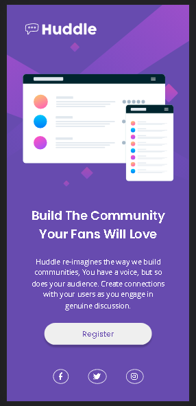
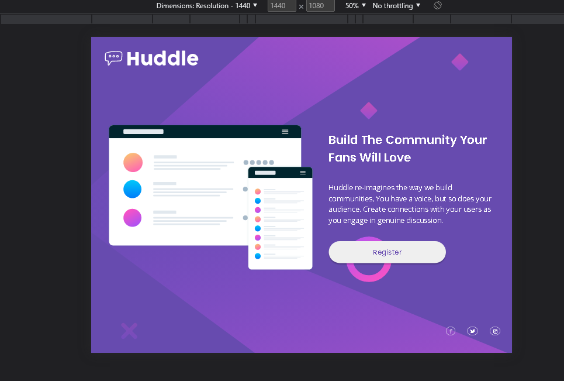
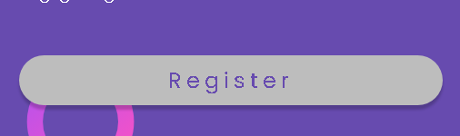

# Huddle landing page with a single introductory section

Isso é uma solução criada do desafio do: [Frontend Mentor](https://www.frontendmentor.io/challenges/huddle-landing-page-with-a-single-introductory-section-B_2Wvxgi0). 

**Atenção o código apresentado é de minha autoria, não foi copiado de tutoriais, cursos e etc.**
## Tabela de conteúdo

- [Geral](#geral)
  - [O desafio](#o-desafio)
  - [Prints](#prints)
  - [Links](#links)
- [Meu processo](#meu-processo)
  - [Construido com](#Construido-com)
  - [O que eu aprendi](#o-que-eu-aprendi)
  - [Considerações finais](#Considerações-finais)
  - [Recursos que me ajudaram](#Recursos-que-me-ajudaram)
- [Autor](#autor)

## Geral

### O desafio:

O usuário deverá:

    -Ter o layout otimizado para cada tipo de dispositivo (responsividade)
    -Observar os elementos com hover na pagina

### Prints

Mobile:

Desktop

Hovers

### Links

- Site: [Clique aqui para acessar o site](https://matheuzeba.github.io/Huddle-landing-page-with-a-single-introductory-section/)

## Meu processo

### Construido com

- Html5 sematico
- CSS
- Flexbox
- Mobile-first 

### O que eu aprendi

Esse foi o meu primeiro projeto utilizando um escopo um pouco maior.
Tive um pouco de dificuldade com os links de social media, pois utilizei as imagens do font-awesome (minha primeira vez usando), então eles ficaram um pouco grandões e as bordas não ficaram muito redondinhas.

Mas foi legal ter aprendido sobre o font-awesome e sobre esses icones em geral. 
Eu usei muito o flexbox e a logica em html para poder estrutrar o projeto de forma compativel ao desktop e mobile.

### Considerações finais

Eu sinto que tive uma dificuldade muito grande com width e que unidades utilizar para cada elemento.
Também notei que o site ficou muito colado, então tem isso...
No geral eu sinto que poderia ter ficado melhor, vou tentar novamente esse desafio numa proxima.

### Recursos que me ajudaram

- [Seção de ajuda do Font-Awesome](https://fontawesome.com/support)
- [Css reset do Joshw](https://www.joshwcomeau.com/css/custom-css-reset/)
- [Que unidade utilizar no media-query?](https://zellwk.com/blog/media-query-units/)

## autor

- Github - [matheuzeba](https://github.com/matheuzeba)
- Linkedin - [Meu Linkedin](https://www.linkedin.com/in/matheus-tavares-viana/?lipi=urn%3Ali%3Apage%3Ad_flagship3_profile_view_base_contact_details%3B3vUQkfjeQFmmKSAvffOo%2Fg%3D%3D)
